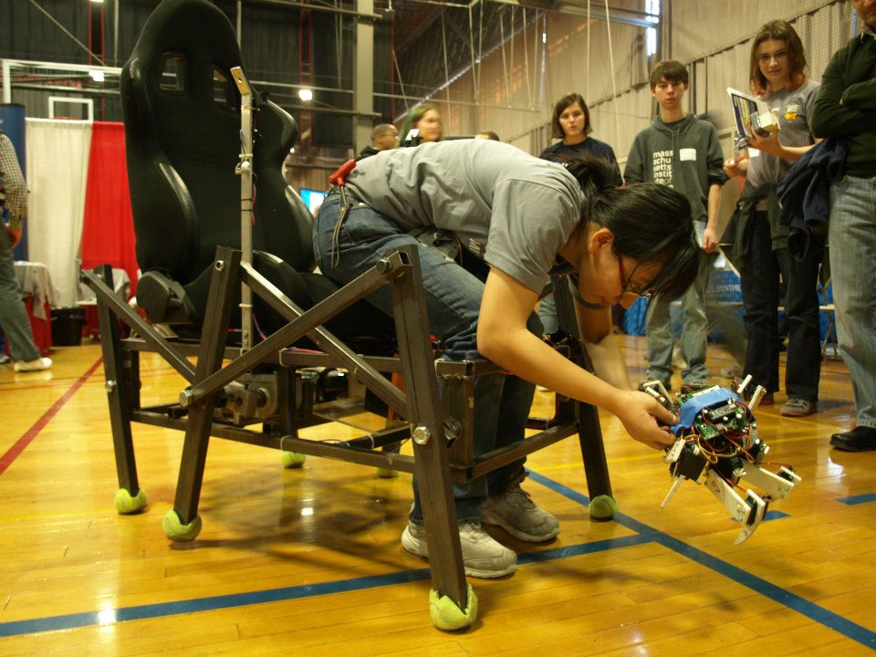
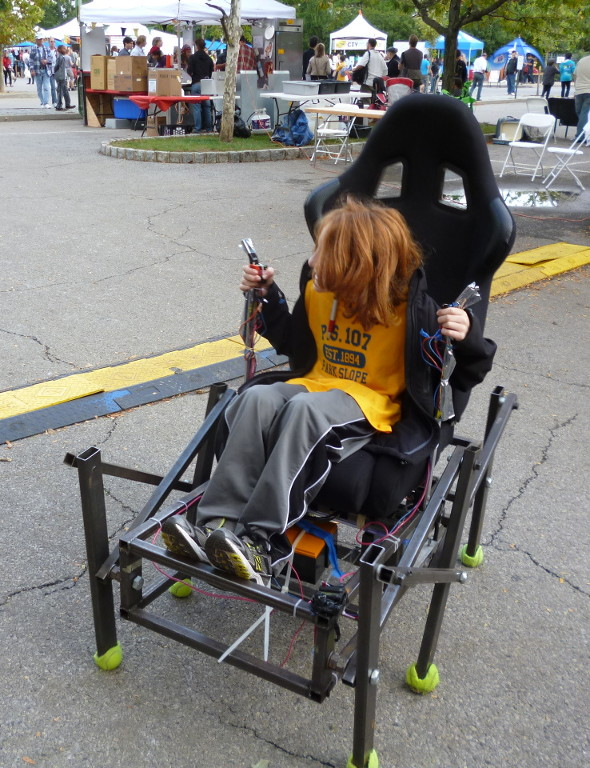

Brief Description: Demo'd at NYC Maker Faire. Welded steel frame, two wheelchair motors, 24V battery pack.

Hexapods are the best robots.

## Rideable Hexapod

*Summer 2011*

Over the summer of 2011, I welded and wired together a rideable hexapod based on designs by Rick Pantaleo. It's built with a steel tubing frame (MIG welded), controlled by two drill trigger controllers, a found racing car seat, and powered by donated A123 lead acid replacement batteries with reused tennis balls for feet. I took it to two New York Maker Faires and let kids ride in it.

**What I did**: This was my own project, focused on fabrication of existing plans, with modifications to the wiring.

NY Maker Faire Demo

A video of a friend riding it:

<video width="601" height="338" controls>
  <source src="yayhexapods.webm" type="video/webm">
Your browser does not support the video tag.
</video>
(Video credit to Colin Parsons)
